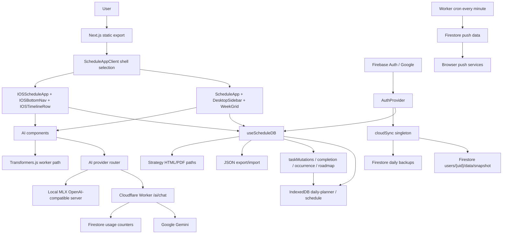
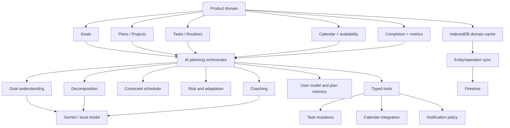

# PlanR Technical Architecture Audit

**Audit date:** 2026-08-20
**Repository:** `my-schedule`
**Method:** Source inspection of the repository, including application code, `lib/`, worker code, configuration, security rules, and tests. No application files were modified during this audit.

## Evidence conventions

- **Confirmed by implementation:** directly verified in source code.
- **Inference:** a reasoned conclusion from implementation, not an explicit contract.
- **Unable to determine:** the repository does not contain enough evidence.

## 1. Executive Summary

PlanR is a local-first personal execution OS. It turns plans into weekday-based task schedules, milestones, routines, progress trackers, notes, and execution analytics. The product intentionally separates two surfaces:

- **Mobile/iOS:** fast daily execution, timeline interaction, completion, tracker logging, reminders, and recovery.
- **Desktop:** planning, plan detail, milestones, task structure, strategy assets, analytics, and broader schedule manipulation.

**Confirmed by implementation:** the primary runtime is a statically exported Next.js 16 application using React 19 and TypeScript. The browser stores the working `Schedule` in IndexedDB. Signed-in users can sync a whole schedule snapshot and daily backups to Firestore. Firebase Authentication uses Google sign-in. A Cloudflare Worker provides push-reminder infrastructure. AI is user-configured through MLX (default), Ollama, or an OpenAI-compatible API, with a Transformers.js worker also present.

The most important architectural characteristic is the single aggregate schedule document. It makes local-first reads and migrations simple, but it also creates payload, concurrency, conflict-resolution, and data-isolation risks as plans, notes, strategy assets, completion history, and trackers grow.

The strongest next step is not a rewrite. It is to stabilize the current aggregate model, add schema and payload boundaries, improve sync conflict visibility, then introduce an explicit AI orchestration layer over the existing plan, task, milestone, tracker, and analytics primitives.

## 2. Current Product Functionality

Confirmed product capabilities:

- Local-first schedule creation and execution.
- Plans with descriptions, icons, dates, tasks, milestones, and trackers.
- Tasks with weekday recurrence, one-off recurrence, interval recurrence, per-date exceptions, custom per-day slots, multi-slot phases, subtasks, completion history, missed state, and task types.
- Routine/session tasks and ritual completion tracking.
- Today timeline and list views.
- Desktop multi-day timeline with 1D, 3D, 7D, and custom-day views.
- Drag-to-create and Cmd/Ctrl-drag task move/resize behavior on desktop.
- Task completion, subtask completion, slot completion, missed-task recovery, and task snoozing.
- Milestone roadmap calculations, progress, status, dates, linked tasks, and linked trackers.
- Progress trackers with metric entries, goal direction, goal values, trends, and sparklines/charts.
- Notes with rich text, tags, daily capture, task links, and exports.
- Strategy HTML/PDF import/rendering paths.
- Local reminders and optional browser push infrastructure.
- JSON backup/export/import and signed-in cloud backup history.
- Google authentication and guest mode.
- AI plan creation, task generation, milestone generation, subtask generation, plan coaching, AI actions, and streaming response parsing. Availability is controlled by `AI_ENABLED`.

**Confirmed by implementation:** `AI_ENABLED` is currently `true` in [`lib/featureFlags.ts`](lib/featureFlags.ts), although [`README.md`](README.md) still describes AI as gated off. Documentation and runtime behavior are inconsistent.

## 3. Technology Stack

```text
Frontend
+- Framework: Next.js 16.2.4, App Router, static export
+- Language: TypeScript 5, React 19.2.4
+- Styling: Tailwind CSS 4, custom CSS tokens in app/globals.css
+- UI: local React components and UI primitives
+- State: React state, Context, custom IndexedDB hook, module-level sync singleton
+- Routing: one static root route; in-app numeric tab/view state
+- Forms: controlled React inputs and custom sheets
+- Validation: local validation helpers and Zod in selected AI/parsing paths
+- Animation: Framer Motion 12
+- Drag/drop: @dnd-kit/core and @dnd-kit/sortable
+- Icons: @tabler/icons-react
+- Rich text: TipTap extensions plus react-markdown
+- Charts: local chart components, SVG/CSS chart rendering
+- Documents: react-pdf and PDF worker copy scripts
+- Testing: Node built-in test runner and Playwright
```

```text
Backend
+- Runtime: Cloudflare Worker runtime for worker/src/index.ts
+- Framework: Worker fetch handler, no Express or server framework
+- API architecture: Worker HTTP endpoints plus Firestore REST/admin access
+- Authentication: Firebase Auth in the client; Firebase ID-token verification in AI flow
+- Database: Firestore for signed-in schedule snapshots, backups, usage, and push data
+- Local database: IndexedDB in the browser
+- Storage: Firebase Storage client is initialized; actual asset-storage policy is not verified
+- Serverless functions: Cloudflare Worker cron and fetch handler
+- External services: Firebase, browser Push services, optional local MLX/Ollama/API providers
```

Exact dependency and script versions are in [`package.json`](package.json). No lock file was identified in the repository inventory used for this report; the resolved transitive dependency graph is therefore not documented here.

## 4. Repository Structure

```text
/
+- app/
|  +- layout.tsx
|  +- page.tsx
|  +- globals.css
+- components/
|  +- ScheduleApp.tsx                 desktop/tablet application shell
|  +- ScheduleAppClient.tsx           shell selection boundary
|  +- DesktopScheduleAppEntry.tsx     desktop motion entry
|  +- ios/                            iOS shell and iOS-specific views
|  +- desktop/                        desktop shell, timeline, AI panels
|  +- plan/                           plans, plan detail, milestones, trackers
|  +- task/                           task sheets and task controls
|  +- activity/                       routines, sessions, task details
|  +- today/                          Today list/timeline pieces
|  +- timeline/                       timeline rendering and utilities
|  +- notes/                          notes and rich text
|  +- strategy/                       strategy import/rendering
|  +- auth/                            auth/settings UI
|  +- sync/                            sync status UI
|  +- ui/                              reusable controls and surfaces
+- contexts/
|  +- AuthProvider.tsx
+- lib/
|  +- useScheduleDB.ts                Schedule types and IndexedDB hook
|  +- scheduleNormalize.ts             migrations/normalization
|  +- cloudSync.ts                     Firestore sync and backups
|  +- taskCompletion.ts                completion state machine
|  +- taskOccurrence.ts                recurrence/occurrence resolution
|  +- taskMutations.ts                 task writes and slot operations
|  +- roadmapEngine.ts                 milestone/roadmap calculations
|  +- planProgress.ts                  linked task/milestone progress
|  +- ai*.ts and ai/                   AI providers, prompts, parsing, actions
|  +- notes/                            note model and rich-text helpers
|  +- strategy/                         strategy parsing/sanitization
|  +- timeline/                         timeline display and drag logic
+- worker/
|  +- src/index.ts                     Worker endpoints and cron handler
|  +- src/usage.ts                      AI quota usage
|  +- wrangler.toml                     Worker deployment/configuration
+- public/                              PWA assets, manifests, service worker inputs
+- scripts/                             build/PDF/service-worker helpers
+- tests/                               Node unit tests
+- tests/e2e/                           Playwright browser tests
+- firestore.rules                      Firestore authorization rules
+- firebase.json                        Firebase Hosting configuration
+- next.config.ts                      static export configuration
```

## 5. Frontend Architecture

The application is a client-heavy static export. [`app/page.tsx`](app/page.tsx) is the root entry. [`components/ScheduleAppClient.tsx`](components/ScheduleAppClient.tsx) chooses the appropriate shell. The desktop path enters through [`components/DesktopScheduleAppEntry.tsx`](components/DesktopScheduleAppEntry.tsx) and [`components/ScheduleApp.tsx`](components/ScheduleApp.tsx). The iOS path is implemented in [`components/ios/IOSScheduleApp.tsx`](components/ios/IOSScheduleApp.tsx).

The architecture is feature-oriented rather than route-oriented:

```text
Shell
  -> view/tab state
    -> feature view
      -> feature component
        -> shared UI primitive
          -> lib business helper / schedule mutation
            -> useScheduleDB persistence
```

There is no evidence of a server component data layer, React Query, Redux, Zustand, or a separate API client for application CRUD. Most application data is loaded and mutated in the browser.

## 6. Backend Architecture

**Confirmed by implementation:** Next.js is configured with `output: "export"` in [`next.config.ts`](next.config.ts), so the deployed application is static hosting rather than a Next.js server runtime.

Firebase Hosting serves `out/` and rewrites all paths to `/index.html` in [`firebase.json`](firebase.json). The Cloudflare Worker is separate from the static frontend. It exposes AI and push-related HTTP behavior and runs a one-minute cron trigger for reminders.

The Worker is not an application CRUD backend. Schedule CRUD is performed locally and synchronized directly by the browser through Firebase client SDK calls.

## 7. Database Architecture

### Local database

**Confirmed by implementation:** [`lib/useScheduleDB.ts`](lib/useScheduleDB.ts) opens an IndexedDB database named `daily-planner`, with a versioned schema and a `schedule` object store. The hook is the local source of truth for the live schedule state.

### Cloud database

**Confirmed by implementation:** [`lib/cloudSync.ts`](lib/cloudSync.ts) stores a complete schedule snapshot at:

```text
users/{uid}/data/snapshot
```

Daily backups are stored at:

```text
users/{uid}/backups/{YYYY-MM-DD}
```

The sync path is debounced, manual/resume-aware, and uses timestamp comparison. It does not use Firestore realtime listeners. The README documents retention of the ten most recent daily backups.

### Firestore authorization

[`firestore.rules`](firestore.rules) allows read/write below `users/{uid}/...` only when the authenticated Firebase UID matches the path UID. All other documents are denied.

**Unable to determine from the current codebase:** deployed rule version, Firebase Storage rules, Firebase App Check configuration, and production IAM configuration.

### Entity model

```text
User
+- Firebase Auth identity
+- users/{uid}/data/snapshot
|  +- Schedule
|     +- plans[]
|     +- activities[DayKey][] -> Task templates
|     +- milestones[] -> planId, linkedActivities[], linkedTrackers[]
|     +- progressTrackers[] -> planId
|     +- metricEntries[] -> trackerId
|     +- rituals[]
|     +- ritualCompletions[]
|     +- notes[]
|     +- strategies[]
|     +- progressTrackers[]
|     +- preferences
|     +- categories[]
+- users/{uid}/backups/{date}
```

### Major entities

**Schedule**

- Purpose: aggregate local/cloud document and root application state.
- Stored in: IndexedDB `schedule`; Firestore `users/{uid}/data/snapshot`.
- Identifier: local database record; cloud path is UID-based.
- Important fields: plans, weekday activities, milestones, trackers, metric entries, rituals, notes, strategies, preferences, categories.
- Created/updated by: `useScheduleDB` and mutation helpers.
- Read/write: local hook, cloud sync, JSON backup/restore.

**Plan**

- Purpose: container for planned work, milestones, trackers, dates, and metadata.
- Stored in: `Schedule.plans[]`.
- Identifier: generated plan ID.
- Relationships: tasks refer through `planId`; milestones and trackers also refer through `planId`.
- Operations: plan views, `AddPlanSheet`, edit/delete handlers, templates, AI plan actions.

**Task**

- Purpose: executable work or held-time commitment.
- Stored in: `Schedule.activities[DayKey][]`.
- Identifier: generated task ID, reused across weekday buckets for recurring task identity.
- Important fields: title, description, planId, taskType, start/end, slots, subtasks, recurrence, exceptions, completion state/history, active date window, category.
- Relationships: plan, milestones through linked activity IDs, notes through links, subtasks embedded or inherited from plan items.
- Operations: `taskMutations.ts`, `taskCompletion.ts`, `taskOccurrence.ts`, task sheets, Today/timeline cards.

**Milestone**

- Purpose: date-bounded roadmap phase and progress checkpoint.
- Stored in: `Schedule.milestones[]`.
- Identifier: generated milestone ID.
- Relationships: plan, linked task IDs, linked tracker IDs.
- Operations: `MilestoneSheet`, roadmap helpers, `PlanDetailView`, completion handlers.

**ProgressTracker / MetricEntry**

- Purpose: numeric progress measurement and trend tracking.
- Stored in: `Schedule.progressTrackers[]` and `Schedule.metricEntries[]`.
- Identifier: tracker ID and entry ID.
- Relationships: tracker -> plan; metric entry -> tracker.
- Operations: tracker sheets, `ProgressChart`, `TrackerTabs`, Today/Overview quick logging.

**Ritual**

- Purpose: recurring routine/session practice.
- Stored in: `Schedule.rituals[]`; completion records in `ritualCompletions[]`.
- Relationships: recurrence weekdays and completion dates.
- Operations: Routine view, ritual sheet, completion statistics.

**Note / Strategy asset**

- Purpose: rich context and imported strategic material.
- Stored in: schedule aggregate; strategy assets may contain HTML/PDF-derived content.
- Risk: large rich text, embedded/base64 document data, and strategy payloads can pressure local and Firestore document limits.

## 8. Authentication

```text
User
  -> AuthProvider
    -> Firebase onAuthStateChanged
      -> user state / authLoading
        -> initSync(uid) when authenticated
        -> destroySync() when signed out
          -> Schedule app runs as signed-in or guest
```

**Confirmed by implementation:** [`contexts/AuthProvider.tsx`](contexts/AuthProvider.tsx) uses Firebase Google authentication with `signInWithPopup`, `signOut`, and `onAuthStateChanged`. It exposes `user`, `authLoading`, `isGuest`, `isAuthAvailable`, `login`, and `logout`.

Guest mode is the fallback when Firebase is not configured or no user is signed in. Guest data remains local because `queueSync` is a no-op without a UID. Logout attempts a best-effort sync flush before signing out.

**Unable to determine:** email/password auth, password reset, additional OAuth providers, application roles, organization permissions, and multi-user collaboration. No role model was found.

## 9. Routing

The repository contains one static application route. Navigation is primarily internal tab and selected-entity state, not URL routing.

```text
/
+- Overview        activeTab = 4
+- Today           activeTab = 0
+- Plans           activeTab = 1
|  +- selected plan detail
+- Routine         activeTab = 2
+- Review          legacy/conditional tab surface, activeTab = 3 in older paths
+- Settings        activeTab = 5
+- Notes           activeTab = 6
```

Desktop navigation is [`components/desktop/DesktopSidebar.tsx`](components/desktop/DesktopSidebar.tsx). Mobile/iOS navigation is [`components/BottomNav.tsx`](components/BottomNav.tsx) and [`components/ios/IOSBottomNav.tsx`](components/ios/IOSBottomNav.tsx). Selected plan detail is rendered in the shell rather than navigated through a URL.

**Consequence:** deep links, browser history for selected plans, shareable plan URLs, and route-level data loading are not implemented as a first-class model.

## 10. State Management

```text
Global-ish application state
+- AuthProvider context
+- Schedule state inside useScheduleDB
+- module-level cloudSync singleton
+- module-level feature flags

Feature state
+- ScheduleApp: active tab, selected plan, sheets, drag state, theme/shell state
+- IOSScheduleApp: selected plan, sheets, mobile page state, timeline state
+- PlanDetailView: plan tab, selected tracker, tracker/milestone sheets, AI coach state
+- TaskSheet: draft fields, repeat mode, per-day slots, edit scope
+- Notes/strategy/AI components: local controlled state

Persistence/server state
+- IndexedDB schedule snapshot
+- Firestore whole-snapshot sync for signed-in users
+- Firebase Auth session state
+- Worker/Firestore AI usage and push data
```

There is no Redux, Zustand, React Query, SWR, or server-state cache. React state changes call `setSchedule`, which normalizes/persists locally and queues cloud sync where applicable.

## 11. API Architecture

### Firebase client services

| Service | Function | Auth | Used by |
|---|---|---|---|
| Firebase Auth | Google popup sign-in, sign-out, auth observer | Firebase SDK | `AuthProvider` |
| Firestore | schedule snapshot read/write, backup list/read/delete | Firebase Auth UID | `cloudSync.ts`, settings/backup flows |
| Firebase Storage | client initialization is present | Firebase Auth expected | strategy/asset paths; exact production use requires further verification |

### Cloudflare Worker

| Endpoint/function | Purpose | Input/output | Auth |
|---|---|---|---|
| `POST /push/test` | push delivery test path | subscription payload | route-specific validation requires review |
| Cron `* * * * *` | scheduled reminder processing | Firestore REST/config data | Worker secrets |

**Unable to determine:** a conventional REST/GraphQL application API for plans/tasks/projects. Application CRUD is not routed through such an API.

## 12. AI Architecture

The repository contains multiple AI paths.

### User-linked AI providers

- Trigger: AI assistant, plan coach, AI plan creator, task/milestone/subtask generation, or AI action surface.
- Input: user prompt plus plan, task, milestone, or schedule context.
- Prompt construction: `lib/ai.ts`, `lib/aiActions.ts`, `lib/coachSkills.ts`, and feature-specific builders.
- Transport: client AI router -> selected MLX, Ollama, or OpenAI-compatible endpoint.
- Default: local MLX server at `http://localhost:8080` using `mlx-community/Qwen3-4B-4bit`.
- Configuration: provider URL, model, and optional API key are stored per browser in AI Settings.
- Output: streamed text or structured-looking text parsed by local parsers.
- Persistence: accepted tasks, milestones, plans, tracker links, and coach messages are written back into `Schedule`; raw transient responses are UI state.
- Error handling: abort controllers, fallback model behavior, user-facing error messages, and AI availability gates.

### Local MLX/OpenAI-compatible provider

- Trigger: provider router selects local provider/settings path.
- Endpoint: `http://localhost:8080` according to the provider implementation.
- Auth: local server expectation; no account requirement in the router comments.
- Output: OpenAI-compatible completion/streaming response.
- Persistence: same feature-specific handlers as remote AI when accepted.

### Transformers.js worker

- `workers/aiWorker.ts` and related files contain an on-device inference path.
- README states this stack is gated and not loaded while the flag is off; current feature flag inspection shows `AI_ENABLED = true`, so the exact runtime reachability of every local inference surface should be tested rather than inferred from README text.

### AI data flow

```text
User action
  -> AI UI component
    -> feature handler / prompt builder
      -> provider router
        +- Cloudflare Worker -> Firebase token verification -> Gemini -> stream
        +- Local MLX server -> OpenAI-compatible response
        +- local worker path where enabled
      -> stream/parser/validator
        -> preview or suggestion UI
          -> explicit user acceptance
            -> Schedule mutation
              -> IndexedDB
                -> debounced Firestore sync when signed in
```

**Security note:** user-provided context is included in prompts. Prompt-injection resistance, output policy enforcement, and tool authorization boundaries are not established as a separate orchestration layer.

## 13. Goal System

There is no separately named `Goal` entity in the primary schedule model verified for this audit. Goals are represented through plan metadata, measurable tracker targets, milestones, descriptions, and AI prompts.

**Confirmed by implementation:** plans can have dates, descriptions, metrics, milestones, tasks, and trackers. `milestoneIntelligence.ts` detects measurable goals from milestone text and can suggest a tracker. This is goal-adjacent intelligence, not a general goal graph.

Lifecycle currently implemented:

```text
Create/edit Plan
  -> add task/milestone/tracker structure
    -> execute linked tasks
      -> completion history and metric entries
        -> plan/milestone/tracker analytics
```

**Unable to determine:** hierarchical goals, goal status independent of plans, goal dependency graphs, automatic goal completion, or a universal goal health model.

## 14. Task System

Task lifecycle:

```text
TaskSheet / AI generation / import / timeline create
  -> task draft validation
    -> createTask/updateTaskDays/updateTaskPerDay/setTaskException
      -> weekday activity bucket in Schedule
        -> occurrence resolution for a date
          -> Today/timeline rendering
            -> completion/subtask/slot/missed mutation
              -> completionHistory and analytics
```

Implemented task capabilities:

- weekday templates and active repeat days;
- one-off and interval recurrence;
- per-date exceptions;
- custom per-day time slots;
- multi-slot phases;
- subtasks and plan-item fallback;
- tracked task vs commitment distinction;
- completion, partial completion, missed, reset, and history;
- task movement/resizing on desktop;
- linked plan and milestone relationships;
- AI-created tasks with explicit acceptance paths.

**Unable to determine:** general task priority, arbitrary task dependencies, a separate project entity, cross-plan dependency graph, or calendar-provider task ownership.

## 15. Project System

The codebase uses **Plans** as the top-level work container. A separate Project entity was not verified. Plan detail, milestones, linked tasks, trackers, and strategy assets provide project-like behavior.

Inference: a future Project abstraction could be introduced as a compatibility layer over Plans, but it should not be added until the product distinction between plan, goal, and project is explicit.

## 16. Planning System

### Implemented

- Date and weekday recurrence logic.
- Timeline display window and minute mapping.
- Task duration and slot calculations.
- Custom per-day schedules.
- Milestone date cascading and roadmap calculations.
- Plan progress and consistency calculations.
- Missed-task recovery and occurrence exceptions.
- Timeline drag creation, movement, and resizing.
- AI-assisted task/plan/milestone suggestions.

### Partially implemented

- AI planning: generation exists, but it is suggestion-oriented and user acceptance is required; there is no verified autonomous planner loop.
- Replanning: missed recovery and exceptions exist, but no general constraint-aware automatic rescheduler was verified.
- Goal planning: plans/milestones support a roadmap, but no universal goal decomposition graph exists.
- Notifications: local timers are implemented; Worker push infrastructure exists, but end-to-end production behavior requires deployment verification.

### UI-only or not verified

- A full intelligent prioritization engine.
- Dependency-aware scheduling.
- Calendar integration.
- Constraint solving around availability, energy, location, and competing commitments.
- Predictive failure detection and automatic plan adaptation.

## 17. User Journey

```text
Open static PlanR app
  -> shell selection based on viewport/safe mode
    -> IndexedDB schedule loads locally
      -> guest mode or Firebase auth restoration
        -> Overview or Today
          -> create Plan
            -> add tasks, routines, milestones, trackers, notes
              -> execute Today schedule
                -> complete tasks / log metrics / recover misses
                  -> review consistency, milestones, trends, and backups
                    -> optionally use AI to generate or coach
```

The actual default tab depends on safe mode, first-launch state, and shell behavior. The user does not create a standalone Goal object in the current primary flow.

## 18. Important Data Flows

### Create plan

`AddPlanSheet` or AI plan creator -> Schedule plan mutation -> IndexedDB -> optional debounced Firestore sync -> Plans list update.

### Create task

`TaskSheet`, timeline gesture, import, template, or AI action -> validation -> `taskMutations.ts` -> weekday activity bucket -> IndexedDB -> Today/Plans/timeline recompute.

### Complete task

Today/timeline card -> `taskCompletion.ts` -> completion fields/history -> `setSchedule` -> local persistence -> progress/consistency/streak recompute -> optional cloud queue.

### Log tracker

Quick-log button -> tracker entry sheet -> metric entry append -> `Schedule.metricEntries` -> sparkline/trend/progress update -> optional sync.

### Milestone progress

Milestone links task IDs and tracker IDs -> `planProgress.ts` / `roadmapEngine.ts` -> calculated status/progress -> Plan detail UI.

### Authentication

Google popup -> Firebase auth observer -> AuthProvider user state -> `initSync(uid)` or `destroySync()` -> schedule remains local while cloud behavior changes.

### AI

AI UI -> prompt/context construction -> provider router -> Worker/Gemini or local model -> parser/preview -> explicit accept -> schedule mutation -> local/cloud persistence.

## 19. Component Architecture

Shared primitives include `Button`, `IconButton`, `BottomSheet`, `SheetHeader`, `ProgressBar`, `Pill`, `Badge`, `CheckDraw`, `InternalSectionTitle`, and surface constants in `components/ui/`.

Feature components include:

- `PlanDetailView`, `PlanCard`, `PlanSelector`, `MilestoneSheet`, `AccuracyCalendar`;
- `TaskSheet`, `TaskBlockCard`, `CompactTaskCard`, task detail and subtasks sheets;
- `TodayTaskList`, `IOSTimelineRow`, `WeekGrid`, timeline layers;
- `OverviewDashboard`, `ReviewView`, `RoutineView`, `RitualView`;
- Notes, strategy, auth/settings, sync, AI, and onboarding feature trees.

The architecture is reusable at the UI level but some shell-level orchestration remains concentrated in large components, especially `ScheduleApp.tsx` and `IOSScheduleApp.tsx`.

## 20. Security Review

### High: aggregate document overwrite risk

- **Location:** [`lib/cloudSync.ts`](lib/cloudSync.ts)
- **Problem:** the full schedule is synced as one timestamped Firestore document with last-writer-wins behavior.
- **Why it matters:** edits made on two devices can silently replace unrelated changes.
- **Recommended direction:** move toward per-entity or operation-based sync, or at minimum expose conflicts and preserve both snapshots.

### High: large unbounded aggregate payload

- **Location:** `Schedule` model and `trimForSync` in `lib/cloudSync.ts`
- **Problem:** notes, completion history, strategy HTML/PDF-derived data, and all entities share one document.
- **Why it matters:** Firestore document limits, IndexedDB growth, sync latency, and accidental data loss.
- **Recommended direction:** enforce schema/size limits and split large assets/collections.

### Medium: AI quota update atomicity requires review

- **Location:** `worker/src/usage.ts`
- **Problem:** audit evidence indicates quota accounting uses read-then-write behavior.
- **Why it matters:** concurrent requests may exceed per-user/global limits.
- **Recommended direction:** Firestore transaction or atomic increment with idempotency.

### Medium: strategy HTML sanitization

- **Location:** `lib/strategy/sanitizeStrategyHtml.ts`, strategy render components
- **Problem:** the audit identified regex-style sanitization around HTML/srcDoc rendering.
- **Why it matters:** malformed or malicious imported HTML can become script-capable if the sanitizer misses a case.
- **Recommended direction:** use a standards-based sanitizer with an allowlist and isolate rendering where possible.

### Medium: push test authorization

- **Location:** Worker push route
- **Problem:** audit evidence indicates `/push/test` validation may focus on subscription payload rather than a complete Firebase-user authorization boundary.
- **Why it matters:** unauthorized notification injection or abuse.
- **Recommended direction:** verify Firebase ID token, bind subscription to UID, and enforce ownership/rate limits.

### Medium: prompt injection and sensitive context

- **Location:** AI prompt/context builders and Worker endpoint
- **Problem:** plan notes and user content can enter model context; a separate prompt-injection policy/tool authorization layer was not verified.
- **Why it matters:** untrusted plan content may influence generated actions or expose context.
- **Recommended direction:** separate instructions from data, validate structured outputs, require explicit action approval, and never let model text directly authorize mutations.

### Low/unknown: Firebase Storage rules

- **Problem:** Firebase Storage is initialized but a storage rules file was not verified.
- **Recommended direction:** add and test explicit UID-scoped storage rules before storing user assets remotely.

## 21. Performance Review

### High

- Whole-snapshot sync scales with every entity and can serialize large schedules frequently.
- Large shell components perform broad derived computations and can cause wide render invalidation after schedule updates.

### Medium

- Firestore backup pruning lists and deletes backup documents during a successful daily push.
- Timeline and analytics calculations scan weekday buckets repeatedly; many are memoized, but schedule changes invalidate broad memo boundaries.
- AI streams and rich text/PDF paths can increase bundle and memory pressure.

### Low

- Static export and local-first IndexedDB reduce server round trips and improve first interaction.
- Existing memoization, dynamic imports, worker paths, and debounced sync are good foundations.

Recommended measurements: schedule serialization size, IndexedDB write duration, React render profiling after completion, Worker latency, AI stream cancellation rate, and mobile memory use with rich strategy assets.

## 22. Code Quality Review

Strengths:

- Strong TypeScript domain types in `useScheduleDB.ts`.
- Business logic is often extracted into pure helpers and covered by Node tests.
- Shared completion and occurrence logic reduces desktop/iOS behavioral drift.
- Comments frequently explain non-obvious product invariants.
- Dynamic imports keep heavy feature surfaces out of the initial path.

Risks:

- Large shell components combine orchestration, derivation, rendering, persistence callbacks, and modal composition.
- In-app numeric tabs are less explicit and less linkable than route objects.
- Aggregate `Schedule` state increases coupling between unrelated features.
- README and feature-flag state are inconsistent.
- Some feature paths have duplicated desktop/iOS rendering logic, even where shared helpers exist.
- Tests are strongest for pure logic; component-level and security-rule coverage is less evident.

## 23. Current Architecture Diagram



## 24. Feature Matrix

| Feature | Status | Evidence / explanation |
|---|---|---|
| UI / static app shell | Implemented | Next static export and shell components |
| Local-first IndexedDB | Implemented | `lib/useScheduleDB.ts` |
| Guest mode | Implemented | `AuthProvider`, cloud queue no-op without UID |
| Google authentication | Implemented | `AuthProvider` |
| Firestore sync | Implemented | `cloudSync.ts`, rules |
| Realtime sync | Not implemented | README and sync code state no realtime listeners |
| Daily cloud backups | Implemented | `cloudSync.ts` |
| Plans | Implemented | Plan model, Plan views/sheets |
| Tasks/subtasks | Implemented | Task model and mutation/completion helpers |
| Projects | Not implemented as a separate entity | Plans serve as container |
| Recurrence/exceptions | Implemented | `taskOccurrence.ts`, Task fields |
| Milestones/roadmap | Implemented | `roadmapEngine.ts`, `PlanDetailView` |
| Progress trackers | Implemented | tracker/metric models and UI |
| Notes/rich text | Implemented | notes feature and TipTap |
| Strategy import/render | Implemented, security review needed | strategy feature |
| Local reminders | Implemented | `lib/reminders.ts` |
| Production push reminders | Partial / deployment not verified | Worker cron/push paths |
| Gemini AI | Implemented in code, deployment availability unverified | Worker + client router |
| Local MLX AI | Implemented provider path | `lib/ai/providers/mlx.ts` |
| Transformers.js AI | Partial/gated reachability | worker path and feature flags |
| AI plan/task/milestone generation | Implemented | AI actions and sheets |
| Autonomous planning/replanning | Not implemented | no verified orchestration loop |
| Calendar integration | Not implemented | no provider integration verified |
| Analytics/trends/streaks | Implemented | analytics/consistency helpers and views |
| Rule/security tests | Partial | unit/e2e present; full deployed-rule coverage not verified |

## 25. Current Limitations

- One aggregate snapshot limits independent sync and scaling.
- No first-class Goal or Project entity distinction.
- No URL-addressable plan/task navigation.
- No verified calendar integration or availability model.
- No general constraint-aware scheduling or automatic replanning.
- AI produces suggestions but is not an autonomous planning agent.
- User behavioral memory is not a separate durable model.
- Worker deployment and production AI availability cannot be confirmed from repository code alone.
- README describes AI as disabled while current feature flags enable it.
- Storage rules and deployment security configuration are not represented in the repository.
- Component tests and security-rule tests are less comprehensive than pure logic tests.

## 26. AI Planning Opportunities

| Current capability | Missing capability | Why it matters | Existing support | Direction | Difficulty |
|---|---|---|---|---|---|
| Plans + milestones | Goal intelligence/decomposition | Converts vague outcomes into executable structure | `milestoneIntelligence`, roadmap helpers | Add typed goal domain and decomposition service | High |
| AI task generation | Constraint-aware scheduling | Generated tasks must fit real time and commitments | timeline/time utilities, task slots | Add availability/constraint model and scheduler | High |
| Missed recovery | Adaptive replanning | Plans should respond to execution evidence | `missedRecovery`, exceptions | Add plan revision proposals and approval flow | High |
| Completion history | Risk/failure prediction | Detects likely misses before deadlines | analytics and history | Build feature extraction and risk scoring | High |
| Coach messages | Long-term AI memory | Coaching should improve from user behavior | plan coach state/messages | Add consented memory summaries with retention policy | High |
| Trackers/trends | Outcome learning | Relates actions to results | metric entries, trends | Add outcome/experiment model and analysis | Medium/High |
| Worker AI endpoint | Tool execution | AI can safely perform approved mutations | existing action parsing | Add typed tools, authorization, audit log, confirmation | High |
| Local-first schedule | Calendar/context integration | Plans need external availability | no integration verified | Add OAuth connector layer and normalized events | High |
| Reminders | Context-aware notifications | Timing should reflect risk and readiness | local/Worker reminders | Add notification policy and user controls | Medium |

## 27. Future Architecture

Evolve incrementally around current boundaries:



Do not let model output call arbitrary setters. The orchestrator should emit typed proposals, validate them, show diffs, require user approval for consequential changes, then invoke existing mutation functions.

## 28. Recommended Database Evolution

### Near term

1. Add runtime schema validation for the aggregate schedule before local persistence and cloud writes.
2. Add byte-size checks and explicit limits for notes, strategy HTML, PDF-derived data, completion history, and AI messages.
3. Keep large assets out of the schedule document; store metadata and references instead.
4. Add an explicit `schemaVersion` and migration registry for each major entity.
5. Add `updatedAt`, `updatedByDevice`, and mutation identifiers where conflict diagnostics need them.

### Medium term

Split the aggregate into user-scoped documents/collections while retaining a local aggregate adapter:

```text
users/{uid}/plans/{planId}
users/{uid}/tasks/{taskId}
users/{uid}/milestones/{milestoneId}
users/{uid}/trackers/{trackerId}
users/{uid}/metricEntries/{entryId}
users/{uid}/notes/{noteId}
users/{uid}/strategyAssets/{assetId}
users/{uid}/syncOperations/{operationId}
```

The client can continue exposing a `Schedule` facade so feature components do not all need to change at once.

## 29. Recommended AI Architecture

Introduce an AI application layer between feature components and provider transport:

```text
AI feature
  -> context assembler
    -> policy / privacy filter
      -> typed prompt or tool request
        -> provider router
          -> model
            -> structured output validator
              -> proposal store
                -> user approval
                  -> domain mutation
                    -> audit/event record
```

Core modules:

- `ai/context`: bounded schedule, goal, progress, and user context.
- `ai/policy`: privacy mode, provider permission, prompt-injection boundaries.
- `ai/tools`: typed task/plan/milestone/tracker operations.
- `ai/schemas`: Zod schemas for every model output.
- `ai/proposals`: diffable, reviewable changes.
- `ai/memory`: consented summaries with deletion/export.
- `ai/evals`: prompt and planning regression fixtures.
- `ai/orchestrator`: goal-to-plan-to-execution loop.

The existing `lib/ai/providers/router.ts`, `lib/aiActions.ts`, `lib/planInsights.ts`, `lib/roadmapEngine.ts`, and mutation helpers are natural extension points.

## 30. Development Roadmap

### Phase 0 - Stabilize

- Add schema/size validation and migration tests.
- Fix README/feature-flag documentation drift.
- Add Firebase Storage rules and Worker route authorization tests.
- Replace unsafe HTML sanitization.
- Make AI quota updates atomic.
- Add sync conflict diagnostics and backup restore tests.

Likely areas: `lib/cloudSync.ts`, `lib/scheduleNormalize.ts`, `lib/strategy/`, `worker/src/`, `firestore.rules`, tests.

### Phase 1 - Strengthen Current Planner

- Formalize Plan, Task, Milestone, Tracker contracts.
- Improve task priorities, dependencies, and availability preferences.
- Add URL state for selected plan and meaningful browser history.
- Consolidate desktop/iOS shared feature presenters.

### Phase 2 - Goal Intelligence

- Add first-class Goal entity and goal-to-plan relationship.
- Add goal understanding and decomposition proposals.
- Generate milestone/task drafts with explicit user approval.

### Phase 3 - AI Planning

- Add typed scheduling constraints.
- Generate feasible time blocks from task durations and availability.
- Add plan-level proposal diffs and batch acceptance.
- Persist plan revisions.

### Phase 4 - Adaptive Planning

- Observe completion, misses, duration variance, and metric movement.
- Detect risk and propose schedule/milestone changes.
- Add automatic but user-configurable replanning policies.

### Phase 5 - Personal Intelligence

- Build a consented user model: preferences, availability, completion patterns, blockers, and AI interaction history.
- Add privacy controls, retention, export, and deletion.
- Personalize suggestions from evidence rather than generic prompts.

### Phase 6 - AI Agent Platform

- Add typed tools for tasks, plans, notes, calendar, and notifications.
- Require authorization, confirmation, audit logs, and idempotency.
- Add multi-step agent runs with cancellation and recovery.

## 31. Priority Recommendations

1. **Add schema and payload validation at the persistence boundary.** Impact: high. Complexity: medium. Dependency: none. Priority: P0.
2. **Fix Worker authorization and make AI quotas atomic.** Impact: high. Complexity: medium. Dependency: Worker tests. Priority: P0.
3. **Replace regex HTML sanitization with an allowlisted sanitizer.** Impact: high. Complexity: medium. Dependency: rendering test coverage. Priority: P0.
4. **Add explicit sync conflict diagnostics and recovery UI.** Impact: high. Complexity: medium. Dependency: current snapshot metadata. Priority: P1.
5. **Split large assets and eventually entities out of the aggregate Firestore document.** Impact: high. Complexity: high. Dependency: schema/version plan. Priority: P1.
6. **Formalize Goal and Project semantics before expanding AI planning.** Impact: high. Complexity: medium/high. Dependency: product decision. Priority: P1.
7. **Introduce typed AI outputs, proposals, and approval diffs.** Impact: high. Complexity: high. Dependency: schema and domain contracts. Priority: P1.
8. **Add availability, priority, and dependency constraints to the planner.** Impact: high. Complexity: high. Dependency: domain model and calendar decision. Priority: P2.
9. **Build execution-risk scoring from completion history and duration variance.** Impact: medium/high. Complexity: high. Dependency: analytics quality and event normalization. Priority: P2.
10. **Add a consented personal user model and long-term AI memory.** Impact: high. Complexity: high. Dependency: privacy model, user controls, AI orchestration. Priority: P3.

## What should we build next?

The recommended next build is **Phase 0, item 1: a persistence-boundary contract layer**. It is the highest-leverage foundation because it protects the current local-first product while enabling safe AI proposals and future entity-level sync.

A practical first slice would be:

- Define Zod schemas for `Schedule`, `Plan`, `Task`, `Milestone`, `ProgressTracker`, and `MetricEntry`.
- Validate and normalize before IndexedDB writes.
- Validate and trim before Firestore writes.
- Add explicit size diagnostics for rich notes, strategy assets, completion history, and AI messages.
- Add fixtures for migrations, malformed imports, oversized content, and unknown fields.
- Keep existing public component APIs unchanged.

This should be followed by Worker authorization/quota hardening and sync conflict diagnostics before adding autonomous AI behavior.

## Accuracy boundaries

- No secrets or secret values were inspected or included.
- Production deployment state, deployed Firebase/Storage rules, Cloudflare secret configuration, and live Gemini availability cannot be determined from this repository alone.
- A separate Project entity, first-class Goal entity, calendar integration, autonomous replanning loop, vector search, embeddings, and long-term memory were not confirmed by implementation.
- Recommendations in Sections 26-31 are future architecture, not current functionality.
